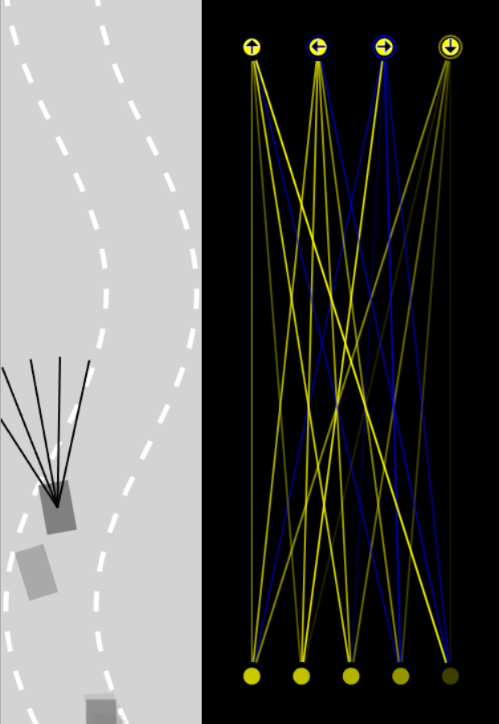

# Self Driving Car

Self-driving cars, also known as autonomous vehicles, are cars that can operate without the need for a human driver. They use a combination of sensors, cameras, and artificial intelligence (AI) algorithms to navigate roads, avoid obstacles, and make decisions about driving. Self-driving cars have the potential to revolutionize transportation by reducing the number of car accidents caused by human error, improving traffic flow, and making it easier for people who cannot drive, such as the elderly or disabled, to get around. However, there are still many challenges that need to be addressed before self-driving cars become commonplace on our roads, including regulatory and safety concerns, technological limitations, and public acceptance.

## Use Neural Network 

Neural networks are a key component of the artificial intelligence algorithms used in self-driving cars. These networks are designed to mimic the way the human brain processes information, allowing the car to "learn" from its environment and make decisions based on that learning.

One important use of neural networks in self-driving cars is perception. The car's sensors gather data about its surroundings, such as the location of other vehicles, pedestrians, and traffic signs. This data is then processed by the neural network, which identifies objects and their movements, and makes decisions about how to respond.

Another important use of neural networks in self-driving cars is decision-making. The car's AI system uses the data gathered by its sensors and processed by the neural network to make decisions about how to navigate the road. For example, it might decide to change lanes to avoid a slow-moving vehicle or to brake suddenly to avoid a pedestrian.

Overall, neural networks are a critical tool for enabling self-driving cars to perceive and react to their surroundings in real-time, making them an essential component of this cutting-edge technology.

## Demo

## Special Thanks To

 - [Radu Mariescu-Istodor](https://www.youtube.com/@Radu)
 - [Freecode Camp](https://www.youtube.com/@freecodecamp)

## Author

- [Souvik2376](https://github.com/Souvik2376)
